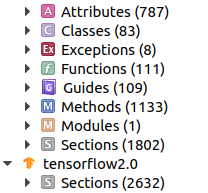

### Environments

```
Ubuntu 18.04
python3 
	pip install markdown Pygments bs4
```
### Steps to generate docset from tensorflow
* Download source code from tensorflow and build the documents from source code. Just following the tutorial from [tensorflow](https://www.tensorflow.org/community/contribute/docs). 

* Convert `markdown` files to `html` files

  * Generate a `css` file for code highlighting
  
    ```shell
    pygentize -S default -f html > default.css
    ```
  
  * Download a github stylesheet from [here](https://gist.github.com/andyferra/2554919), and save file as `github.css`
  
  * Generate `html` with `python-markdown`
  
    ```shell
    python md2html.py
    ```
  
  * Modify the hyperlinks in `html`, such as './tf/dtypes/dtypes.md'  -> './tf/dtypes/dtypes.html',  modify the link to the source code to online source code, such as "/code/stable/tensorflow/keras/backend.py" -> "https://github.com/tensorflow/tensorflow/blob/r2.0/tensorflow/keras/backend.py"
  
    ```shell
    ./mdhtml.sh
    ```
  
* remove `.md` files 

  ```shell
  python tt.py
  ```

* convert `html` to `docset`:

  ```shell
  python html2dash.py [-n DocsetName] [-i icon.jpg] [sourceDir]
  ```

* Add `default.css` and `github.css` to `xxx.docset/Contents/Resources`


### Notes

* If you want to change code highlighting styles, please refer to `Pygments`.

* Welcome for star and fork!

* Actually, the generated docset has no types like `function`, `attributes`, `classes`, it only has `sections`. I am looking forward that  someone has some method to deal with this problem.

  